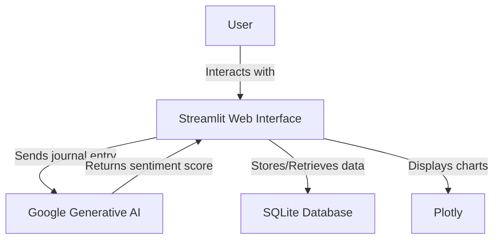

# Mood Tracker

Mood Tracker is a Streamlit-based web application that allows users to journal their daily moods and visualize their emotional trends over time. The app uses Google's Generative AI to analyze the sentiment of journal entries and stores the data in a SQLite database.

## Features

- Daily journal entries
- Sentiment analysis of entries using Google's Generative AI
- Mood trend visualization for the past 7 days
- Display of past entries

## Architecture



## Installation

1. Clone the repository:
   ```
   git clone https://github.com/yourusername/mood-tracker.git
   cd mood-tracker
   ```

2. Create a virtual environment (optional but recommended):
   ```
   python -m venv venv
   source venv/bin/activate  # On Windows, use `venv\Scripts\activate`
   ```

3. Install the required packages:
   ```
   pip install streamlit google-generativeai pandas plotly
   ```

4. Set up your Google API key:
   - Obtain an API key from the Google Cloud Console
   - Set it as an environment variable:
     ```
     export GOOGLE_API_KEY='your-api-key-here'
     ```

## Running the Application

1. Ensure you're in the project directory and your virtual environment is activated (if used).

2. Run the Streamlit app:
   ```
   streamlit run mood_tracker.py
   ```

3. Open a web browser and go to the URL provided by Streamlit (usually http://localhost:8501).

## License

MIT License

Copyright (c) [year] [fullname]

Permission is hereby granted, free of charge, to any person obtaining a copy
of this software and associated documentation files (the "Software"), to deal
in the Software without restriction, including without limitation the rights
to use, copy, modify, merge, publish, distribute, sublicense, and/or sell
copies of the Software, and to permit persons to whom the Software is
furnished to do so, subject to the following conditions:

The above copyright notice and this permission notice shall be included in all
copies or substantial portions of the Software.

THE SOFTWARE IS PROVIDED "AS IS", WITHOUT WARRANTY OF ANY KIND, EXPRESS OR
IMPLIED, INCLUDING BUT NOT LIMITED TO THE WARRANTIES OF MERCHANTABILITY,
FITNESS FOR A PARTICULAR PURPOSE AND NONINFRINGEMENT. IN NO EVENT SHALL THE
AUTHORS OR COPYRIGHT HOLDERS BE LIABLE FOR ANY CLAIM, DAMAGES OR OTHER
LIABILITY, WHETHER IN AN ACTION OF CONTRACT, TORT OR OTHERWISE, ARISING FROM,
OUT OF OR IN CONNECTION WITH THE SOFTWARE OR THE USE OR OTHER DEALINGS IN THE
SOFTWARE.
